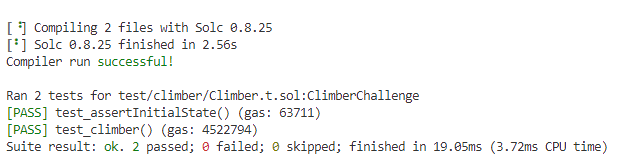

# Climber
```
    function test_climber() public checkSolvedByPlayer {
        ClimberAttack climberAttack = new ClimberAttack(vault, IERC20(address(token)));
        climberAttack.exploit(recovery);
    }
```
